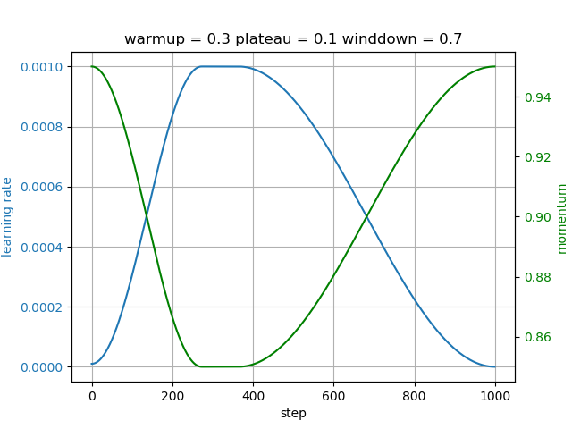

# OneCycleCosine

Implements the [modified version][blog] of Leslie Smith's 1cycle policy described by Sylvain Gugger and Jeremy Howard for [PyTorch][pytorch].
This version uses cosine annealing like the FastAI version but has three phases instead of two:

1. warmup - cosine annealed warmup
2. plateau - learning rate constant at maximum and momentum constant at minimum
3. winddown - cosine annealed winddown

Phases 1 and 3 are the same as phases 1 and 2 FastAI 1cycle policy.
Phase 2 is described in the [FastAI blogpost][blog].

- OneCycleCosine should be used for optimizers which have a 'momentum' parameter
- OneCycleCosineAdam should be used for Adam based optimizers which have a 'betas' parameter tuple

## References

- FastAI Blogpost - [https://www.fast.ai/2018/07/02/adam-weight-decay][blog]
- Original Paper - [https://arxiv.org/abs/1803.09820][paper]

[blog]: https://www.fast.ai/2018/07/02/adam-weight-decay
[paper]: https://arxiv.org/abs/1803.09820
[pytorch]: https://pytorch.org/
[fastai]: https://www.fast.ai/
